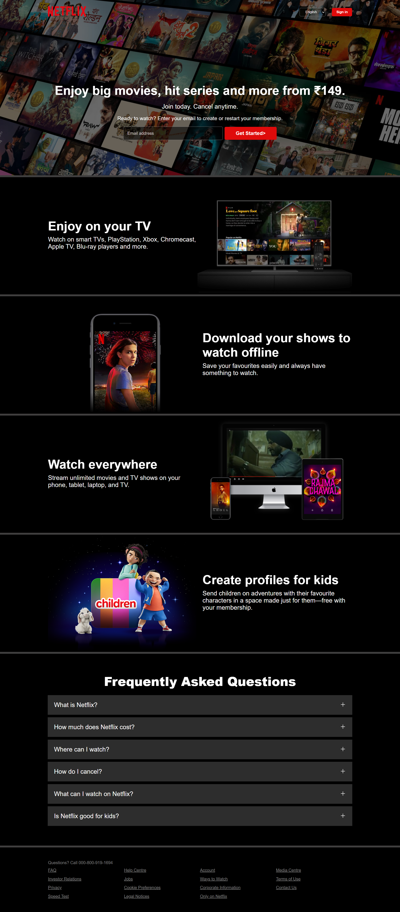
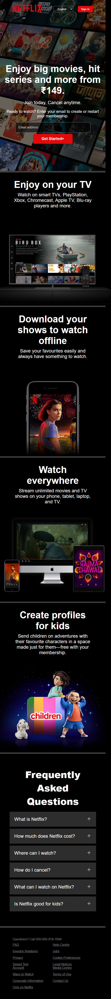

# 🎬 Netflix Homepage Clone

A pixel-perfect frontend clone of the Netflix landing page built using **pure HTML and CSS**. This project focuses on layout structure, responsive design, and visual accuracy — great for practicing real-world UI replication.

---

## 🌟 Features

- 📺 Replicates Netflix homepage UI  
- 📱 Fully responsive layout  
- 💅 Hover effects and clean design  
- 🚫 No JavaScript — purely HTML & CSS

---

## 🔧 Tech Used

- HTML5  
- CSS3  
- Google Fonts  
- Font Awesome (for icons)

---

## 📸 Screenshots

> Make sure to save your screenshots in `/screenshots` and name accordingly:

### 🖥️ Desktop View  


### 📱 Mobile View  


---

## 💻 Getting Started

### 1. Clone the repository

```bash
git clone https://github.com/Mohi-th/netflix-clone.git
cd netflix-clone
